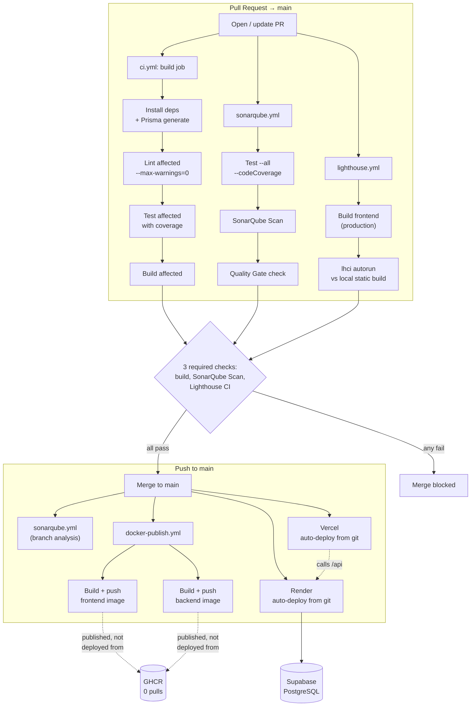

# Angular-Nest-CICD

A full-stack task manager built with **Angular**, **NestJS**, and an **Nx monorepo** — used as a hands-on project to learn and demonstrate a production-grade CI/CD pipeline. The app itself is intentionally simple; the real engineering here is the delivery pipeline wrapped around it.

## 🚀 Live

- **Frontend:** https://angular-nest-cicd.vercel.app/
- **Backend API:** https://angular-nest-cicd-api.onrender.com/api

> Backend is on Render's free tier — expect a ~30–60s cold start after ~15 minutes of inactivity.

[](https://github.com/johannesMatevosyan/angular-nest-cicd/actions/workflows/ci.yml)
[](https://github.com/johannesMatevosyan/angular-nest-cicd/actions/workflows/lighthouse.yml)
[](https://sonarcloud.io/project/overview?id=johannesMatevosyan_angular-nest-cicd)
[](https://sonarcloud.io/project/overview?id=johannesMatevosyan_angular-nest-cicd)

## 📖 About

This repo exists to go deep on the delivery pipeline, not the app. Every stage was built to understand the *reasoning* behind each decision, not just to get it working:

- Continuous integration with `nx affected` (only lint/test/build what actually changed)
- Branch protection via GitHub Rulesets on `main` — three required checks (`build`, `SonarQube Scan`, `Lighthouse CI`), plus an automated PR bot comment on every run
- Automated quality gates: SonarQube Cloud (code quality + coverage) and Lighthouse CI (performance/accessibility/best-practices/SEO thresholds), both required to pass before merge
- Strict ESLint enforcement — non-blocking `warn` locally, zero-tolerance (`--max-warnings=0`) in CI
- Multi-stage Docker builds for both apps, with a local `docker-compose` dev environment (Postgres included)
- Automated container image publishing to GitHub Container Registry on every merge to `main`

## 🛠 Tech Stack

| Layer | Tech |
|---|---|
| Frontend | Angular 22 (standalone components, esbuild builder) |
| Backend | NestJS 11 |
| ORM | Prisma 7 (driver adapters — `@prisma/adapter-pg`) |
| Database | PostgreSQL — Supabase (production) |
| Monorepo | Nx 23 |
| Containers | Docker (multi-stage builds), Docker Compose (local dev) |
| CI | GitHub Actions |
| Registry | GitHub Container Registry (GHCR) |
| Hosting | Vercel (frontend), Render (backend) |
| Quality gates | SonarQube Cloud, Lighthouse CI |
| Linting | ESLint, strict in CI (`--max-warnings=0`) |

## 🏗 Pipeline Overview



**On every PR to `main`:** three independent workflows run in parallel — `ci.yml` (lint/test/build via `nx affected`), `sonarqube.yml` (code quality + coverage), `lighthouse.yml` (performance/accessibility/SEO against a production build). All three are required GitHub Rulesets checks; a PR cannot merge unless every one of them passes, and the branch must be up to date with `main`.

**On merge to `main`:** SonarQube re-runs as a branch analysis (this is what updates the badges above), `docker-publish.yml` builds and pushes both Docker images to GHCR, and — independently of anything in this repo — Vercel and Render each detect the push via their own GitHub integration and redeploy from source.

## 🏷 Image Tagging Strategy

`docker-publish.yml` pushes every image with two tags:
- `:latest` — a convenience pointer for local `docker pull`
- `:<short-sha>` — immutable, always traceable back to the exact commit that produced it

**Worth being upfront about:** these images aren't currently what's running in production. Vercel builds the Angular app directly from source, and Render's backend service is a plain git-native buildpack deploy (`npm install && npm run db:generate && nx build backend`, no Dockerfile involved at all) — neither platform pulls from GHCR. The Docker pipeline here is a real, working demonstration of multi-stage builds and registry publishing (Stage 3 of the learning plan) and the engine behind local `docker-compose up`, kept intentionally separate from the live deployment path. See [Packages](https://github.com/johannesMatevosyan/angular-nest-cicd/pkgs/container/angular-nest-cicd-backend) for published images.

## 📦 Local Development

```bash
git clone https://github.com/johannesMatevosyan/angular-nest-cicd.git
cd angular-nest-cicd
docker compose up --build
```

This spins up Postgres, the NestJS API, and the Angular frontend (via nginx) as three networked containers. First run applies migrations automatically.

Manual (non-Docker) setup:

```bash
npm install
npm run db:generate
npm run db:migrate
npx nx serve backend    # http://localhost:3000/api
npx nx serve frontend   # http://localhost:4200
```

Requires a `.env` in `apps/backend` with `DATABASE_URL` and `DIRECT_URL` (Supabase's pooled vs. direct connection strings — the direct one is required for running migrations).

## 📝 Notes

Detailed build notes, gotchas, and interview-prep write-ups for each stage of this pipeline live in `CICD-Notes.md` and `InterviewNotes.md`. Architectural reasoning and trade-offs live in `Architecture.md`.
